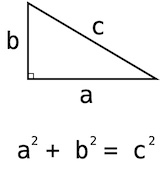

# [2번] 피타고라스의 정리

<br>

## 문제설명
직각삼각형이 주어졌을 때, 빗변의 제곱은 다른 두 변을 각각 제곱한 것의 합과 같습니다.

<br>

직각삼각형의 한 변의 길이를 나타내는 정수 `a`와 빗변의 길이를 나타내는 정수 `c`가 주어질 때, 다른 한 변의 길이의 제곱 `b_square`를 출력하도록 한 줄을 수정해 코드를 완성해 주세요.

<br>

## 제한사항
- 1 ≤ `a` < `c` ≤ 100

<br>

## 입출력 예
- 입력 #1
    ```java
    3
    5
    ```

- 출력 #1
    ```java
    16
    ```

- 입력 #2
    ```java
    9
    10
    ```

- 출력 #2
    ```java
    19
    ```

<br>

## 입출력 예 설명
- 입출력 예 #1
    - a² = 9, c² = 25이므로 16을 출력합니다.

- 입출력 예 #2
    - a² = 81, c² = 100이므로 19를 출력합니다.

<br>

## 링크
[[2번] 피타고라스의 정리](https://school.programmers.co.kr/learn/courses/30/lessons/250132)
