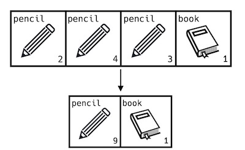
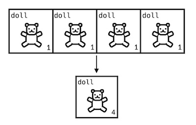
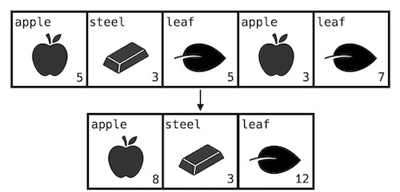

# [8번] 창고 정리

 

## 문제설명
선빈이는 게임을 즐기던 중 가지고 있는 물건이 너무 많아 창고 정리를 하기로 했습니다. 선빈이가 보유한 게임 속 창고는 여러 칸으로 나누어져 있고, 각 칸에는 물건들이 담겨있습니다. 창고를 정리할 방법을 고민하던 선빈이는 같은 물건이 여러 칸에 나누어 들어있는 것을 발견하고, 우선 같은 물건끼리 최대한 겹쳐 쌓는 방식으로 창고를 정리하기로 했습니다. 선빈이의 창고에 들어있는 물건의 이름과 개수는 리스트 형태로 주어지며, 한 칸에 겹쳐질 수 있는 물건의 개수에는 제한이 없다고 가정합니다. 
예를 들어 창고의 각 칸에 담겨있는 물건의 이름이 `storage` = ["pencil", "pencil", "pencil", "book"], 각 물건의 개수가 `num` = [2, 4, 3, 1]이라면 연필과 책을 한 칸에 각각 겹쳐 쌓아 간단하게 `clean_storage` = ["pencil", "book"], `clean_num` = [9, 1]로 만들 수 있습니다.

 

주어진 solution 함수는 정리되기 전 창고의 물건 이름이 담긴 문자열 리스트 `storage`와 각 물건의 개수가 담긴 정수 리스트 `num`이 주어질 때, 정리된 창고에서 개수가 가장 많은 물건의 이름을 return 하는 함수입니다. solution 함수가 올바르게 작동하도록 한 줄을 수정해 주세요.

 

## 제한사항
- 1 ≤ `storage`의 길이 = `num`의 길이 ≤ 30
- `storage[i]`는 영어 대소문자로 이루어져 있습니다.
- 물건은 대소문자를 구분합니다. 즉, "Book"과 "book"은 서로 다른 물건입니다.
- 1 ≤ `storage[i]`의 길이 ≤ 30
- 1 ≤ `num[i]` ≤ 20
- `num[i]`에는 `storage[i]`에 해당하는 물건의 개수가 담겨있습니다.
- 가장 개수가 많은 물건이 두 가지 이상인 경우는 없습니다.
- 한 칸에는 한 종류의 물건만 들어갈 수 있습니다.

 

## 입출력 예
| storage | num | result |
|---|---|---|
| ["pencil", "pencil", "pencil", "book"] | [2, 4, 3, 1] | "pencil" |
| ["doll", "doll", "doll", "doll"] | [1, 1, 1, 1] | "doll" |
| ["apple", "steel", "leaf", "apple", "leaf"] | [5, 3, 5, 3, 7] | "leaf" |
| ["mirror", "net", "mirror", "net", "bottle"] | [4, 1, 4, 1, 5] | "mirror" |

 

## 입출력 예 설명
- 입출력 예 #1
    - 본문에 설명된 대로 창고를 정리하면 `clean_storage` = ["pencil", "book"], `clean_num` = [9, 1]이 됩니다. 따라서 가장 개수가 많은 물건인 "pencil"을 return 합니다.

- 입출력 예 #2
    - 창고를 정리하면 `clean_storage` = ["doll"], `clean_num` = [4]가 됩니다. 따라서 가장 개수가 많은 물건인 "doll"을 return 합니다.
      

- 입출력 예 #3
    - 창고를 정리하면 `clean_storage` = ["apple", "steel", "leaf"], `clean_num` = [8, 3, 12]가 됩니다. 따라서 가장 개수가 많은 물건인 "leaf"를 return 합니다.
      

- 입출력 예 #4
    - 창고를 정리하면 `clean_storage` = ["mirror", "net", "bottle"], `clean_num` = [8, 2, 5]가 됩니다. 따라서 가장 개수가 많은 물건인 "mirror"를 return 합니다.

 

## 링크
[[8번] 창고 정리](https://school.programmers.co.kr/learn/courses/30/lessons/250126)
