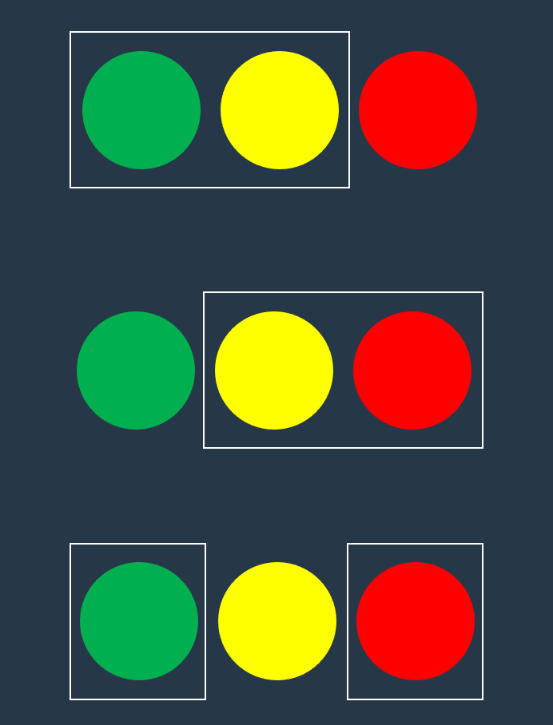
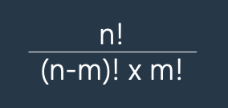

# [Lv.0] 구슬을 나누는 경우의 수

 

## 문제설명
머쓱이는 구슬을 친구들에게 나누어 주려고 합니다. 구슬은 모두 다르게 생겼습니다. 머쓱이가 갖고 있는 구슬의 개수 `balls`와 친구들에게 나누어 줄 구슬 개수 `share`가 매개변수로 주어질 때, `balls`개의 구슬 중 `share`개의 구슬을 고르는 가능한 모든 경우의 수를 return 하는 solution 함수를 완성해 주세요.

 

## 제한사항
- 1 ≤ `balls` ≤ 30
- 1 ≤ `share` ≤ 30
- 구슬을 고르는 순서는 고려하지 않습니다.
- `share` ≤ `balls`

 

## 입출력 예
| balls | share | result |
|---|---|---|
| 3 | 2 | 3 |
| 5 | 3 | 10 |

 

## 입출력 예 설명
- 입출력 예 #1
    - 서로 다른 구슬 3개 중 2개를 고르는 경우의 수는 3입니다.
      

- 입출력 예 #2
    - 서로 다른 구슬 5개 중 3개를 고르는 경우의 수는 10입니다.

 

## Hint
- 서로 다른 `n`개 중 `m`개를 뽑는 경우의 수 공식은 다음과 같습니다.
  

 

## 링크
[[Lv.0] 구슬을 나누는 경우의 수](https://school.programmers.co.kr/learn/courses/30/lessons/120840)
